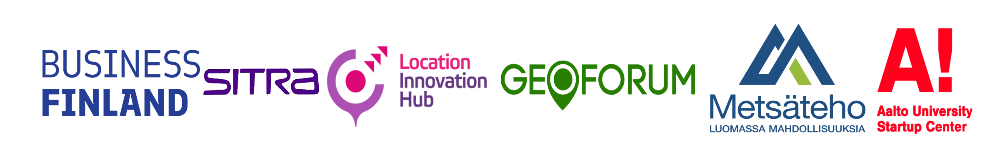

---

title: Workshops 🤖 💡 </> 🏁
subtitle: Hands-on Learning Through **Innovation and Collaboration**
summary: A showcase of workshops and hackathons that amplified my expertise in LiDAR, machine learning, geospatial intelligence, and entrepreneurship—focusing on real-world data challenges and interdisciplinary teamwork in forestry and environmental domains.
tags:
- Hackathon
- LiDAR
- Point Cloud
- Finnish Forests
- Machine Learning
- Geospatial Analytics
- Biodiversity Monitoring
- Remote Sensing
- NLS
- Forest Data
- Spatial AI
- Environmental Data Science
- Entrepreneurship
- Team Collaboration
- Forestry Innovation
date: "2024-03-09"
external_link: ""

image:
  caption: ''
  focal_point: Smart

---

# Beyond Dead Wood Hackathon - Data and AI in search of forest biodiversity
## Ultrahack

**Date**: 9 March, 2024 
**Location**: [Maria01, Lapinlahdenkatu 16, Helsinki](https://maps.app.goo.gl/CTzELxoYeUQnvTpS9) 
**Website**: [Offcial Website of Event](https://new.ultrahack.org/hackathons/beyond-dead-wood-hackathon) 
**Sponsers**: *Business Finland* || *SITRA* || *Location Innovation Hub* || *GEOFORUM* || *Metsäteho Oy* || *Aalto University Startup Center* || *Vaisala* || *NLS* || *Arbonaut* 
 

> Key Highlights:
> * 🌲 Finnish Forest Innovation: Tackled real-world forestry challenges using data science and geospatial insights
> * 🌐 NLS Point Cloud Utilization: Leveraged high-resolution open LiDAR data to analyze forest structure and deadwood distribution
> * 🤖 ML-Powered Forestry Solutions: Teams applied machine learning techniques to classify forest elements and detect biodiversity indicators
> * 💡 Entrepreneurial Focus: Encouraged actionable ideas with commercial potential to benefit forest health and sustainability
> * 👥 Collaborative Hackathon Environment: Brought together interdisciplinary teams combining programming, environmental science, and business
